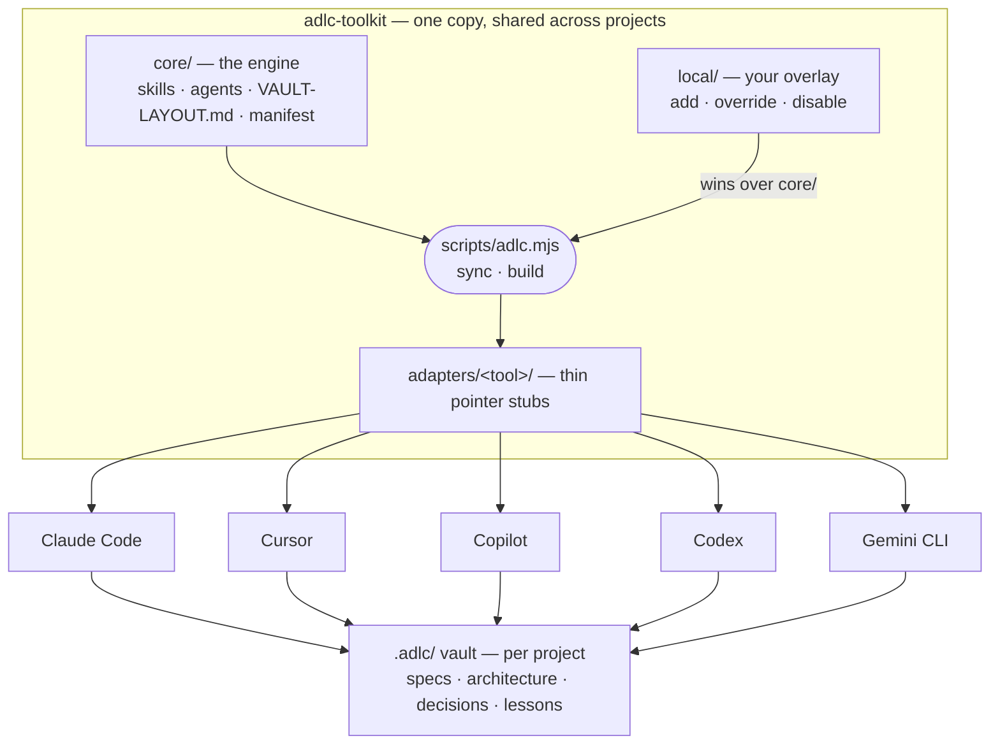
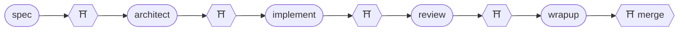
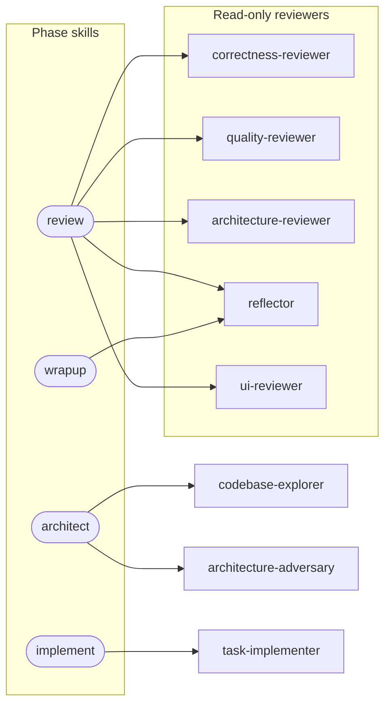
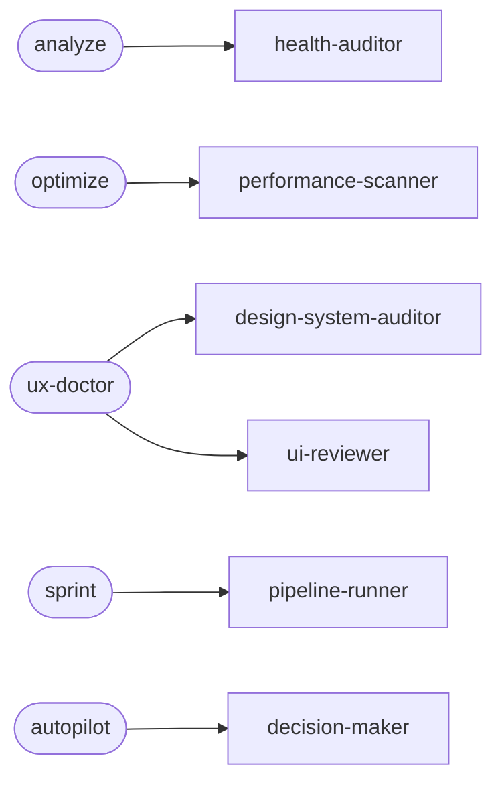

# ADLC Toolkit

**A spec-driven pipeline that makes building with AI fast, accountable, and cumulative.** ADLC (AI Development Life Cycle) turns any AI coding assistant into a disciplined engineering partner: the assistant drafts specs, architecture, code, and reviews; you approve at every phase gate; and what it learns about your codebase compounds in a knowledge vault instead of evaporating with the session.

Works with **Claude Code, Cursor, GitHub Copilot, OpenAI Codex, and Gemini CLI**, on **macOS, Windows, and Linux**, for **teams or solo**. One workflow, one shared knowledge vault, five AI tools.

[`Why ADLC`](#why-adlc) · [`How it works`](#how-it-works) · [`Workflow`](#workflow) · [`Skills`](#skills) · [`Agents`](#agents) · [`Install`](#install) · [`Make it yours`](#make-it-yours) · [`The vault`](#the-vault) · [`Team setup`](#team-setup) · [`Git policy`](#git-policy) · [`Philosophy`](#philosophy)

## Why ADLC

AI assistants generate code faster than most teams can responsibly absorb it. The hard part was never the code — it's everything around the code: the spec that says what to build, the review that catches what's wrong, the memory of why decisions were made, the process a whole team can share. ADLC supplies that structure, so the speed is yours to keep:

<details>
<summary><b>Nothing ships un-decided</b> — five phases, five human gates</summary>

Work moves through spec → architect → implement → review → wrap-up, and each phase ends in a [gate](docs/gate-cards.md) where _you_ approve, redirect, or halt. Gates live at phase boundaries, not between keystrokes — smooth inside, hard stop at the line. The gate is the product, not the overhead.

</details>

<details>
<summary><b>The spec comes first</b> — the cheapest bug is the one caught before code exists</summary>

The assistant never implements against an ambiguous requirement. If the spec is unclear it stops and asks — with concrete options, not open-ended questions. Thirty minutes of spec review prevents days of rework.

</details>

<details>
<summary><b>Reviews you can trust</b> — independent, read-only reviewers</summary>

Reviewers are separate sub-agents that file findings and never fix them. The context that wrote the code never grades its own work, so a passing review means something.

</details>

<details>
<summary><b>A paper trail by construction</b> — every decision, written down</summary>

Every REQ leaves its requirement, architecture, task plan, review verdicts, and decisions in the repo as plain markdown — diffable in the PR, readable a year later. When someone asks "why is it built this way?", there's an answer on file.

</details>

<details>
<summary><b>Knowledge compounds</b> — the pipeline gets better at <i>your</i> codebase</summary>

Lessons, gotchas, and ADRs are captured per REQ and re-read on the next one. What the assistant learns in March is still working for you in November, across sessions and across teammates.

</details>

<details>
<summary><b>Git stays yours</b> — autonomy is a dial you set, with hard limits</summary>

By default the assistant runs zero git writes; you grant more per project (`manual` → `commit` → `commit+push`), and hard invariants — never a protected branch, never a force-push, never a merge — hold at every level. See [Git policy](#git-policy).

</details>

And because the protocol is tool-agnostic, none of this is a bet on one vendor: the same pipeline, vault, and audit trail work across all five assistants — switch tools, keep the workflow.

## How it works

The toolkit keeps the protocol in **one tool-agnostic place** (`core/`) and generates a small **adapter** per tool. An adapter doesn't copy the protocol — it tells the assistant to read the real instructions from `core/` when the command runs, so there is exactly one source of truth and nothing to keep in sync. Your customizations live in `local/`, which the generator resolves _over_ `core/`:



Per project, the `init` command creates a **`.adlc/` vault** — an Obsidian-compatible markdown knowledge base holding that repo's specs, architecture, conventions, decisions, lessons, and gotchas. The vault is plain markdown, so it's portable across tools and survives switching assistants.

<details>
<summary><b>How the pipeline maps onto each tool</b> — the three primitives</summary>

Every major assistant has the same three building blocks — a memory file, custom slash commands, and sub-agents — so the pipeline maps cleanly onto all of them:

| Primitive          | Claude Code         | Cursor                  | Copilot                           | Codex                    | Gemini CLI                |
| ------------------ | ------------------- | ----------------------- | --------------------------------- | ------------------------ | ------------------------- |
| **Memory file**    | `CLAUDE.md`         | `.cursor/rules/*.mdc`   | `.github/copilot-instructions.md` | `AGENTS.md`              | `GEMINI.md`               |
| **Slash commands** | skills (`SKILL.md`) | `.cursor/commands/*.md` | `.github/prompts/*.prompt.md`     | `~/.codex/prompts/`      | `.gemini/commands/*.toml` |
| **Sub-agents**     | `agents/*.md`       | (sequential)            | `.github/agents/*.agent.md`       | `~/.codex/agents/*.toml` | `.gemini/agents/*.md`     |

</details>

<details>
<summary><b>How the vault stays browsable as it grows</b> — optional month/author buckets</summary>

Work records get one folder each under `specs/` (and `bugs/`). On a long-running project that list grows without limit, so `.adlc/config.yml` → `layout.partition: month-author` buckets new folders by creation month and author — `specs/2026-08/sf/REQ-042-payment-retries/` instead of one flat folder per REQ directly under `specs/`. Flat vaults keep working: both shapes resolve in the same vault, forever. Lessons, ADRs, and context pages are never bucketed — you find those by searching, not by browsing. The full path grammar lives in one file, [`core/VAULT-LAYOUT.md`](core/VAULT-LAYOUT.md); nothing else hard-codes a path.

</details>

## Workflow



Every `⛩` is a **human gate**: the pipeline stops, presents a [gate card](docs/gate-cards.md) with the decision and its evidence, and waits. Each gate also drops a `.awaiting-approval` file marker, so you can walk away and resume across sessions.

Run phases one at a time, or chain them with `proceed` (gates between each), `autopilot` (a decision-maker agent adjudicates the inner gates, one final human review at the end), or `sprint` (parallel multi-REQ, each runner pausing at its gates). Bugs take the slimmer `bugfix` pipeline; small changes take `task`, which triages itself and escalates to the full pipeline when the change turns out bigger than claimed.

## Skills

Five phase skills, three orchestrators, two slim pipelines, and a set of standalone audits and utilities — each installed as a slash command in your assistant.

<details>
<summary><b>All 18 skills</b></summary>

| Skill            | What it does                                                                                                               | Ends in gate? |
| ---------------- | -------------------------------------------------------------------------------------------------------------------------- | ------------- |
| `init`           | Bootstrap `.adlc/` vault in a repo                                                                                         | No            |
| `spec`           | Draft + validate a requirement                                                                                             | Yes           |
| `architect`      | Design + task breakdown + validate                                                                                         | Yes           |
| `implement`      | Execute task DAG                                                                                                           | Yes           |
| `review`         | Dispatch reviewers, consolidate findings                                                                                   | Yes           |
| `wrapup`         | Draft PR + lessons + vault updates + git checklist                                                                         | Yes           |
| `proceed`        | Run all five phase skills with gates between                                                                               | —             |
| `autopilot`      | Autonomous pipeline — routes each gate through the decision-maker; ends in one final human review                          | —             |
| `sprint`         | Parallel multi-REQ orchestrator (gate-pause)                                                                               | —             |
| `bugfix`         | Slimmer pipeline for bugs                                                                                                  | Yes           |
| `task`           | Slim self-triaging pipeline for small changes; escalates to `proceed` when large                                           | Yes           |
| `analyze`        | Standalone codebase health audit                                                                                           | No            |
| `optimize`       | Standalone performance/cost scan                                                                                           | No            |
| `ux-doctor`      | Standalone UX & design-system audit — static source pass + runtime browser pass; segments large apps into resumable phases | No            |
| `status`         | Show every active REQ and gate state                                                                                       | No            |
| `recover`        | Reconcile pipeline-state with git reality; back-fill the vault                                                             | No            |
| `config`         | View/change `.adlc/config.yml` settings (git mode, isolation, autonomy…) via guided options                                | No            |
| `toolkit-update` | Update the toolkit from upstream + reconcile adapters; flags `local/` overrides that shadow changed engine files           | No            |

</details>

## Agents

Skills orchestrate; agents do the focused work. The map below shows the main dispatch paths:



The standalone audits and orchestrators each have their own agent:



<details>
<summary><b>All 13 agents, their tiers and roles</b></summary>

| Agent                  | Tier     | Role                                                                                                                         |
| ---------------------- | -------- | ---------------------------------------------------------------------------------------------------------------------------- |
| codebase-explorer      | fast     | One structured recon pass: similar patterns, blast radius, integration points                                                |
| task-implementer       | deep     | Writes code for one task. No git operations.                                                                                 |
| correctness-reviewer   | balanced | Logic, race conditions, security. Read-only.                                                                                 |
| quality-reviewer       | balanced | Conventions, naming, duplication, test coverage. Read-only.                                                                  |
| architecture-reviewer  | balanced | Layering, separation of concerns, API contracts. Read-only.                                                                  |
| architecture-adversary | balanced | Adversarial pre-gate attack on the design + task plan; surfaces only self-refuted findings. Read-only.                       |
| reflector              | balanced | Self-review against captured lessons. Read-only.                                                                             |
| ui-reviewer            | balanced | Runtime UI/UX review — drives a browser to verify render, flows, and design match. Read-only re: source.                     |
| design-system-auditor  | balanced | Static design-system audit: token compliance, scale coherence, duplication, drift. Read-only.                                |
| health-auditor         | balanced | Codebase health audit for `analyze`. Read-only.                                                                              |
| performance-scanner    | balanced | API cost + DB perf + latency for `optimize`. Read-only.                                                                      |
| pipeline-runner        | deep     | Runs the full pipeline for one REQ in a worktree for `sprint`. No sub-agents. Git per `git.mode` (feature branch only).      |
| decision-maker         | deep     | Adjudicates one pipeline gate during an autonomous `autopilot` run — APPROVE / REWORK / HALT with cited evidence. Read-only. |

</details>

Agents are assigned a capability **tier** — `fast`, `balanced`, or `deep` — not a vendor model name. Tiers map to each tool's actual models via `core/manifest.json` → `tierToModel` (e.g. on Claude: fast→haiku, balanced→sonnet, deep→opus), overridable per project in `.adlc/config.yml`. Read-only enforcement strength varies by tool — see the [fidelity matrix](docs/fidelity-matrix.md).

## Install

One command does install _and_ update, global by default — the pipeline becomes available in every repo you open:

```bash
git clone <repo-url> ~/code/adlc-toolkit
cd ~/code/adlc-toolkit
node scripts/adlc.mjs sync --tool=claude     # or cursor · copilot · codex · gemini · all
```

Re-run the same command any time to update — it reconciles added, removed, and renamed skills automatically.

→ **[Quickstart](docs/quickstart.md)** — zero to your first gated REQ in four steps.
→ **[Installation guide](docs/install/README.md)** — updating, project-local installs, regenerating adapters, or letting your AI assistant install it for you.
→ **Per-tool guides:** [Claude Code](docs/install/claude.md) · [Cursor](docs/install/cursor.md) · [GitHub Copilot](docs/install/copilot.md) · [OpenAI Codex](docs/install/codex.md) · [Gemini CLI](docs/install/gemini.md)
→ **[Fidelity matrix](docs/fidelity-matrix.md)** — what's first-class vs. degraded on each tool.

## Make it yours

Every team works differently: different stacks, review bars, ticketing, and house philosophy. **This repo is a starting point, not a framework to obey.** Fork it and shape it to how your team actually works.

The repo is split into two layers so you can do that without ever fighting upstream:

- **`core/` is the engine** — the upstream-maintained protocol. You don't edit it.
- **`local/` is your overlay** — add your own skills/agents, override a core skill's prompt, or disable ones you don't use. Files in `local/` win over files with the same name in `core/`. See **[`local/README.md`](local/README.md)**.

Because your customizations live only in `local/` (plus each project's `.adlc/config.yml`), pulling a new upstream release merges cleanly — there's nothing in `core/` for your changes to conflict with:

```bash
git pull upstream main                  # you never edited core/, so this just merges
node scripts/adlc.mjs sync --tool=all   # reconcile: new skills linked, removed ones pruned
```

<details>
<summary><b>Repo layout</b></summary>

```
adlc-toolkit/
  core/                     # THE ENGINE — upstream-owned protocol (you don't edit this)
    skills/<name>.md        # the command protocols (tool-agnostic)
    agents/<name>.md        # the agent role definitions
    VAULT-LAYOUT.md         # where vault work records live on disk — the only file that knows
    manifest.json           # catalog the generator reads
  local/                    # YOUR OVERLAY — add/override/disable; resolved over core/ (see local/README.md)
  templates/                # vault + in-REQ templates (stack-agnostic)
  adapters/<tool>/          # generated stubs — clone-and-go for each assistant
  scripts/adlc.mjs          # one command: `sync` (install+update) · `build` (regenerate adapters/)
  docs/                     # quickstart, installation, fidelity matrix, per-tool guides
ETHOS.md                    # the seven guiding principles
```

</details>

Team-shaped defaults are configurable, not baked in: REQ IDs can come from your tracker (`req.id_scheme: ticket`) so parallel work never collides, and the shared activity log is union-merged so teammates don't conflict on it. See [Team setup](#team-setup).

## The vault

The `.adlc/` directory is an Obsidian-compatible vault — open it in Obsidian for graph view, backlinks, and Dataview, or just treat it as a directory of markdown.

<details>
<summary><b>Vault conventions</b></summary>

- Wikilinks: `[[concepts/idempotency]]`, `[[knowledge/gotchas#^g05|G05]]`
- Block anchors for stable references: `^L##` (lessons), `^g##` (gotchas), `^ADR-##` (ADRs)
- `STATUS: needs verification` flags provisional content
- Field tables at the top of every spec/concept/ADR; "Related" / "Backlinks" at the bottom

</details>

## Team setup

The toolkit is solo-friendly out of the box; a few settings make it team-safe.

<details>
<summary><b>REQ IDs that don't collide</b> — <code>req.id_scheme</code></summary>

The default `req.id_scheme: sequential` numbers REQs by scanning the vault (`REQ-001`, `REQ-002`, …), so two people starting work at the same time can both end up with `REQ-042` and hit a conflict at merge. For teams, set the scheme in `.adlc/config.yml`:

| `req.id_scheme`                    | ID looks like          | When                                                                                                               |
| ---------------------------------- | ---------------------- | ------------------------------------------------------------------------------------------------------------------ |
| `ticket` _(recommended for teams)_ | `REQ-842` / `PROJ-842` | You wire up `sources.issues`; `/spec #842` derives the ID from the tracker issue. Globally unique by construction. |
| `prefixed`                         | `REQ-sf-007`           | No shared tracker. `req.prefix` (your initials) gives each person a private number space. Works offline.           |
| `sequential` _(default)_           | `REQ-007`              | Solo.                                                                                                              |

The same scheme governs `BUG-*` IDs in `/bugfix`. The scheme is the whole fix, and it works in a flat vault — the ID is what has to be unique, not the directory it sits in.

</details>

<details>
<summary><b>A <code>specs/</code> you can still browse</b> — <code>layout.partition</code></summary>

Unique IDs don't stop the folder list from growing; a year in, `specs/` is a hundred-plus entries and every `ls` and Obsidian file tree pays for it. `.adlc/config.yml` → `layout.partition: month-author` buckets new REQ, bug, and sprint folders by creation month and author, so `specs/` shows a month of work instead of a year of it. This is a **browsing** fix and nothing more. It does not prevent ID collisions — two people minting `REQ-042` just end up with the same ID in two different directories — so it's no substitute for `req.id_scheme`. Existing vaults stay flat; `/config migrate` moves folders into buckets after showing you the plan.

</details>

<details>
<summary><b>A shared history that never conflicts</b> — union-merged logs</summary>

The activity log (`.adlc/hot.md`, plus `decisions.md` and `glossary.md`) is **committed** and carries `merge=union` via the vault's `.gitattributes`, so parallel branches' appends combine instead of conflicting — the team shares one history with zero merge pain. The mutable active-focus view (`now.md`) and per-developer pipeline state stay gitignored and are regenerated from each REQ's `pipeline-state.json` by `/status`. `/init` proposes the right `.gitignore` split automatically.

</details>

## Git policy

How much git the assistant runs is **your choice per project**, set at `init` and stored in `.adlc/config.yml` → `git.mode`:

| `git.mode`         | Behavior                                                                                                                                                                                                                      |
| ------------------ | ----------------------------------------------------------------------------------------------------------------------------------------------------------------------------------------------------------------------------- |
| `manual` (default) | The assistant runs no git writes. It reads git state, creates the REQ's worktree/feature branch, and drafts `commits-draft.md` (after `implement`) and `pr-draft.md` (after `wrapup`). You run every commit, push, and merge. |
| `commit`           | The assistant also `git add` + `git commit`s the approved work on the REQ's feature branch at each gate. You push and open/merge the PR.                                                                                      |
| `commit+push`      | The assistant also `git push`es the feature branch (fast-forward only). You open and merge the PR.                                                                                                                            |

These rules hold in **every** mode: the assistant only ever touches the REQ's own feature branch. It never commits to a protected branch (`git.protect`, default `main`/`master`/`release/*`), never force-pushes, rebases, rewrites history, or deletes branches, and never runs `gh pr create`, `gh pr merge`, or `--no-verify`. `/autopilot`'s `autonomy.git` is capped by `git.mode` and can never exceed it.

## Philosophy

The seven principles in [ETHOS.md](ETHOS.md), injected into every skill: **you decide / the assistant drafts**; **spec first, code second**; **read-only reviewers**; **knowledge compounds**; **process is explicit**; **ask with concrete options, not open-ended questions**; **speak plainly**.

## Contributing / extending

<details>
<summary><b>The five extension paths</b></summary>

- **Customize for your team (don't touch `core/`):** put overrides and additions in `local/` — a file with the same name replaces the core version, a new file adds one, and a `local/manifest.json` entry with `"disabled": true` drops one. Then `node scripts/adlc.mjs sync`. See [`local/README.md`](local/README.md). This is the path that keeps `git pull upstream` conflict-free.
- **Improve the engine (upstream):** edit `core/skills/<name>.md` / `core/agents/<name>.md` (or add/remove in `core/` + `core/manifest.json`), then `node scripts/adlc.mjs sync` — added stubs are linked and removed ones pruned automatically. Open a PR upstream for fixes that aren't team-specific.
- **Add a tool:** add an emitter to the `TOOLS` map in `scripts/adlc.mjs` and regenerate.
- **Add a stack preset:** see `templates/config-template.yml`.
- **Keep `adapters/` in sync automatically:** run `node scripts/adlc.mjs hooks` once — a pre-commit hook rebuilds `adapters/` whenever a commit touches the protocol source. Details in the [installation guide](docs/install/README.md#keeping-adapters-in-sync-automatically).

</details>
