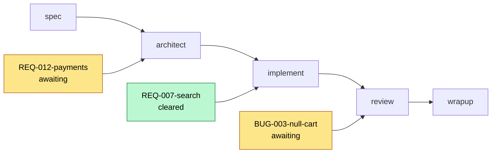

You are surfacing the current state of work in the vault. Read-only, no gates, no side effects.

## When to use

- Start of a new session — orient on what's in flight
- Mid-session — quick "where are we" check
- Sprint mode — see all active REQs at a glance
- Before deciding what to work on next

## Steps

### 0. Read the vault layout

Load `$TOOLKIT_PATH/core/VAULT-LAYOUT.md`. This skill walks `specs/` and `bugs/` to build the dashboard, and a vault may hold flat and bucketed folders at the same time — use its `enumerate` rule rather than listing either tree directly.

### 1. Read the navigation files

- `.adlc/now.md` — active focus marker (manually edited; not always current)
- `.adlc/hot.md` — last 20 entries (the real source of recent activity)
- `.adlc/index.md` — overall vault catalog (for context, not status)

### 2. Walk active REQs

List them with VAULT-LAYOUT's `enumerate(active)` rule — `find .adlc/specs -maxdepth 4 -type d -name 'REQ-*' -not -path '*/_archive/*'` — one pass that catches flat and bucketed folders alike and skips the archive (archived REQs are done by definition). The match is on the folder's **own name**. Don't test for `pipeline-state.json` instead: it's gitignored, so on a teammate's fresh clone every folder looks empty and the dashboard comes back blank. Take the display ID from that same folder name — in a bucketed vault the child of `specs/` is a month like `2026-08`, not an ID.

For each REQ found:

- Read `pipeline-state.json` if it exists — on a fresh clone it won't; list the REQ with its state unknown rather than dropping it
- Skip REQs where `prState == "merged"` and `mergedAt` is more than 7 days old (they're done)
- For each remaining REQ, collect:
  - REQ ID and title
  - Current phase
  - Gate state (`awaiting` vs `cleared`)
  - Isolation mode (`branch` or `worktree`)
  - Work path (verify it exists; flag if missing)
  - In `worktree` mode also verify the worktree is registered with git; in `branch` mode verify the branch ref still exists
  - Branch
  - Blockers list (`pipeline-state.blockers`)
  - Files changed (run `git -C <workPath> diff --name-only <base>..<branch>` if past Phase 3)
  - Findings counts (if past Phase 4)

### 3. Walk active bugs

Same as REQs, with the same rule pointed at `.adlc/bugs` and `-name 'BUG-*'`. Keep the `_archive/` exclusion — `bugs/_archive/` doesn't exist yet, but it costs nothing and the tree may grow one.

### 4. Walk recent audits

For `.adlc/audits/`, find audits from the last 30 days. Note any unaddressed Critical findings.

### 5. Compile and emit

Output a structured status report in chat:

```
ADLC Status — YYYY-MM-DD HH:MM

Active focus (from now.md):
  > <focus line from now.md>

Active REQs:
  REQ-NNN-<slug> | phase: <phase> | gate: <awaiting/cleared> | branch: <branch> | isolation: <mode>
    Work path: <path> [✓ exists / ⚠ missing]
    Files changed: <count>
    Findings: C<critical>/M<major>/m<minor> (if past Phase 4)
    Blockers: <none / list>

Active bugs:
  BUG-NNN-<slug> | phase: <phase> | gate: <state> | <one-line summary>

Recent activity (last 5 entries from hot.md):
  YYYY-MM-DD <kind> | <description>
  YYYY-MM-DD <kind> | <description>
  ...

Recent audits:
  YYYY-MM-DD health  — <count> findings (C<N>/M<N>/m<N>)
  YYYY-MM-DD perf    — <count> findings (C<N>/M<N>/m<N>)
  Unaddressed criticals: <list of finding IDs across audits>

Suggested next actions:
  - Gate to clear: <REQ at awaiting> → /proceed REQ-NNN-<slug>
  - Gate to clear, last activity > 24h ago: → /proceed REQ-NNN-<slug> --resume (shows a catch-up summary first)
  - Want to walk back the most recent phase: → /proceed REQ-NNN-<slug> --revert~1
  - Want to abandon a REQ deliberately: → /proceed REQ-NNN-<slug> --cancel
  - New work: ready to start (no gates pending)
  - Blockers: <list with one-line context>
  - Drift suspected: <count> REQ(s) where pipeline-state may not match git reality → /recover
```

If a REQ's work path is missing — or, in `worktree` mode, the worktree isn't registered with git; or, in `branch` mode, the branch ref is gone — but the REQ isn't marked complete, surface that explicitly. It's an inconsistency the user should know about.

### 6. Pipeline board (when 2+ REQs/bugs are active)

When more than one REQ or bug is in flight, append a Mermaid board after the text report so the whole queue is legible at a glance — which stage each item sits at, and which are waiting on the user. Skip it for a single active item (the text line already says it all). Mermaid renders in Obsidian, GitHub, and markdown-aware IDEs; where it doesn't render, it degrades to readable text, so it's safe to always include when the threshold is met.

Place each active item at its current phase; color by gate state (`awaiting` = waiting on the user, `cleared` = ready to move). Use the item's real ID/slug and current phase:



Keep it to the active items only — don't plot REQs already merged/closed. This is still chat output; write no files.

## Constraints

- **Read-only.** Don't update `now.md`, don't update `hot.md`, don't fix inconsistencies — just surface them.
- **Don't dispatch agents.** This skill is fast and synchronous.
- **Be honest about staleness.** `now.md` is manually edited; if it disagrees with `pipeline-state.json` files, surface both and call out the divergence.
- **Don't over-report.** If there's nothing in flight, say so in one line. The output should be useful, not a wall of text.

## Output

No files written. Status report in chat only.
