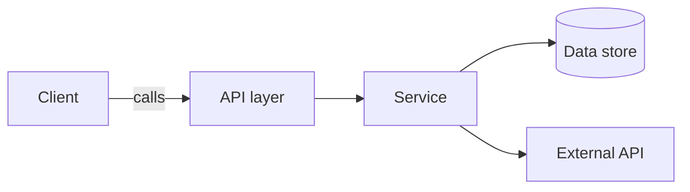
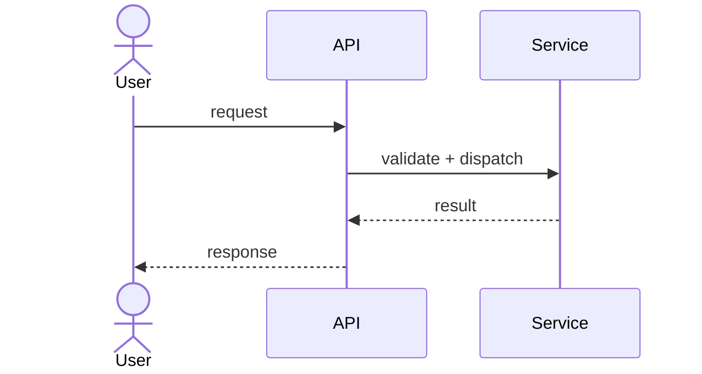
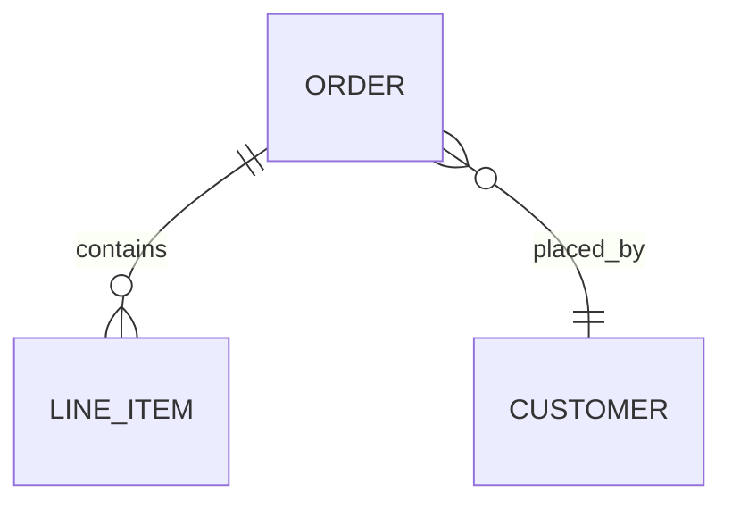
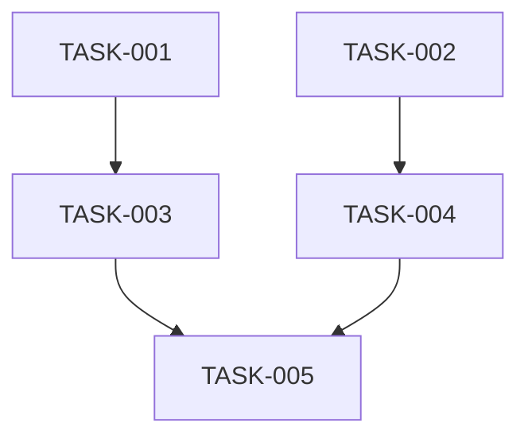

# {{TITLE}} — Architecture

| Field | Value |
|---|---|
| REQ | {{REQ_ID}} |
| Status | drafting \| validated \| superseded |
| Created | {{DATE}} |
| Related ADRs | {{ADR_LINKS}} |

## Summary

One paragraph. What changes, where, and why.

## Blast radius

Files and modules this REQ will touch. Generated from codebase-explorer's recon pass.

| Path | Why touched | Risk |
|---|---|---|
| `src/foo/bar.ts` | Add new method `X` | low |
| `src/foo/baz.ts` | Refactor `Y` to call new method | medium |
| `tests/foo/bar.test.ts` | Add tests for `X` | low |

## Approach

How the change is structured. Two or three paragraphs. Should answer:

- Where does the new code live?
- What existing patterns does it follow?
- What new patterns (if any) does it introduce?
- How does it integrate with existing code?

### Diagrams

Include a diagram when the change has shape that's hard to hold in the head from prose — a flow across components, an ordered interaction, a state machine, a data model, or a structural decomposition. Skip it when it would only restate a paragraph. One diagram, one idea; label the edges; keep it readable (about 7 boxes). The prose stays the source of truth — the diagram is the glance. Use Mermaid so it renders in Obsidian, GitHub, and your IDE alike. A diagram describes the *designed* state; keep it in sync or mark it `STATUS: needs verification`.

Reach for whichever fits (delete the rest — most REQs need zero or one):

**Component / structure** — how the pieces fit and where the new code lives:

**Sequence** — a multi-actor flow where ordering matters (the key path only):

**Data model** — only when entities or schema change:

## Task DAG

Tasks grouped by dependency. Tier 0 depends on nothing; each later tier depends only on earlier tiers, so everything in one tier can run in parallel.

### Tier 0
- `TASK-001` — {{description}}
- `TASK-002` — {{description}}

### Tier 1
- `TASK-003` — depends on TASK-001
- `TASK-004` — depends on TASK-002

### Tier 2
- `TASK-005` — depends on TASK-003, TASK-004

Render the graph too when there's more than a couple of tasks — it makes the parallelizable work obvious at a glance (edit nodes/edges to match the tiers above):

## Test strategy

What gets tested at what level. Unit, integration, end-to-end. Specific test files to add.

## Convention alignment

How this design follows `.adlc/context/conventions.md`. Call out any deviations and why.

## Risks

What could go wrong. What we're betting on. What we'd do if the bet fails.

| Risk | Likelihood | Mitigation |
|---|---|---|
| {{risk}} | low \| med \| high | {{mitigation}} |

## Open questions

- [ ] Anything that couldn't be resolved at architecture time

## Related

- Spec: {{REQ_ID}} — resolve the folder per `core/VAULT-LAYOUT.md`
- Concepts: {{CONCEPT_LINKS}}
- Components: {{COMPONENT_LINKS}}
- Lessons checked: {{LESSON_LINKS}}
- ADRs: {{ADR_LINKS}}
