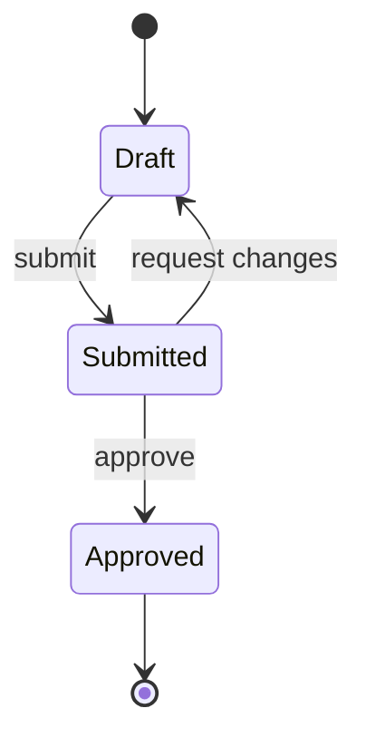

# {{TITLE}}

| Field | Value |
|---|---|
| REQ | {{REQ_ID}} |
| Status | drafting \| validated \| in-progress \| complete \| blocked |
| Phase | spec \| architect \| implement \| review \| wrapup |
| Created | {{DATE}} |
| Primary repo | {{REPO_ID}} |
| Touched repos | {{REPO_LIST}} |
| Related | {{WIKILINKS}} |

## Problem

What hurts today, who feels it, and how often. One paragraph. No solutions yet.

## Goal

The state of the world after this REQ ships. One paragraph. Specific enough that a reviewer can tell whether you achieved it.

## Non-goals

What this REQ explicitly does **not** cover. Two or three bullets. Saves arguments later when the design is drawn up.

## Acceptance criteria

Bulleted list of testable statements. Each one is a thing that must be true for the REQ to be considered done.

- [ ] Criterion 1
- [ ] Criterion 2
- [ ] Criterion 3

## Flow (optional)

Include a small diagram **only** when the behavior has states or branches that are hard to hold in the head from prose — a multi-step user journey, a state machine (draft → submitted → approved), a decision with several outcomes. Skip it for straightforward CRUD or a single happy path; a diagram that just restates a sentence is noise. This stays at the *what* level (user-visible states and transitions), not the *how* — leave components and sequencing to `/architect`. Use Mermaid so it renders everywhere; delete this section if it doesn't earn its place.

## Assumptions

Things you're treating as true to keep moving. Mark unconfirmed ones with `STATUS: needs verification` and link the assumption file if one was created.

- Assumption 1
- Assumption 2 — `STATUS: needs verification`

## Open questions

Anything ambiguous that affects scope or design. Resolved before the spec gate clears.

- [ ] Question 1
- [ ] Question 2

## Out of scope (for now)

Adjacent work that's tempting but separate. Filed here so it's visible but not bundled in.

## Related

- Concepts: {{CONCEPT_LINKS}}
- Components: {{COMPONENT_LINKS}}
- Lessons: {{LESSON_LINKS}}
- ADRs: {{ADR_LINKS}}

## Backlinks

_(populated by /wrapup or manually)_
